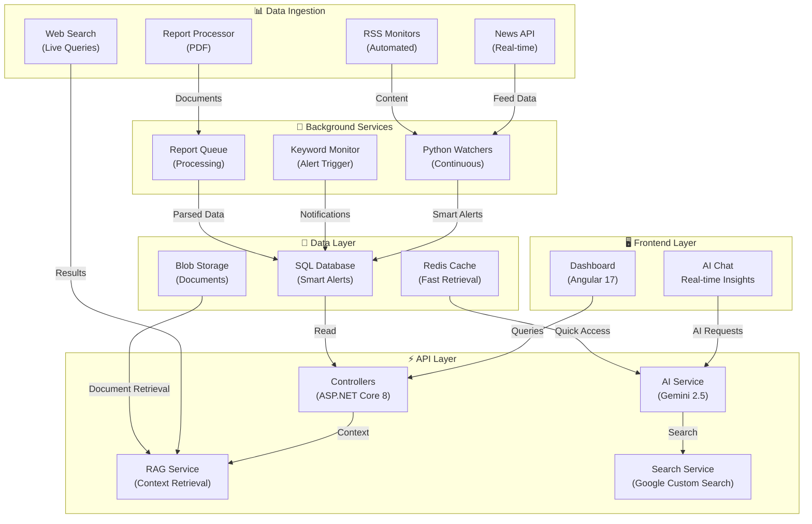

# Alfanar MarketIntel | Competitive Intelligence Platform

**Real-time market intelligence with AI-powered insights. Monitor competitors, track market trends, and identify opportunities automatically.**

---

## 🎯 Purpose

Alfanar MarketIntel automates competitive intelligence gathering across multiple data sources (news, reports, technology updates, regulatory filings) using AI to extract actionable insights, generate alerts, and provide real-time market positioning intelligence.

## ✨ Core Features

- **Smart Alerts**: Real-time notifications on competitor activities, market changes, and opportunities
- **Live Web Search**: AI-enhanced search with current market data integration  
- **Auto-Monitoring**: Continuous tracking of RSS feeds, competitor websites, and regulatory databases
- **AI Chat**: Conversational intelligence retrieval with RAG (Retrieval-Augmented Generation)
- **Trend Analytics**: Market and competitive positioning dashboards
- **Multi-Source Ingestion**: News APIs, custom RSS monitors, and report processing

## 🏗️ System Architecture



## 🚀 Quick Start

### Prerequisites
- .NET 8 SDK
- Node.js 18+ (for Angular)
- SQL Server or LocalDB
- Python 3.10+

### Setup & Run

```bash
# Clone and navigate
cd d:\Storage\ Market\ Intel\Alfanar.MarketIntel

# Backend (.NET API)
cd Alfanar.MarketIntel.Api
dotnet build
dotnet run --configuration Development
# API runs on http://localhost:5021

# Frontend (Angular Dashboard)
cd ../Alfanar.MarketIntel.Dashboard
npm install
ng serve
# Dashboard at http://localhost:4200

# Python Watchers
cd ../python_watcher
python -m venv venv
source venv/Scripts/activate  # Windows: venv\Scripts\activate
pip install -r requirements.txt
python main_watcher.py
```

### Verification Checklist

- [ ] API running on port 5021 (dotnet process visible)
- [ ] Dashboard accessible at http://localhost:4200
- [ ] Smart Alerts section loads without errors
- [ ] AI Chat responds to queries with live web search
- [ ] Python watchers running (check logs in python_watcher/logs/)

## 📈 Trust Signals: What Makes MarketIntel Credible

### Data Source Transparency
- **Real-time Sources**: NewsAPI (500K+ articles), Google News integration
- **Custom Monitors**: RSS feeds, competitor websites, regulatory databases (SEC, stock exchanges)
- **Web Search**: Google Custom Search API with current market data
- **Document Processing**: PDF/report extraction from uploaded sources

### Data Freshness Guarantees
- News alerts: **≤5 minutes latency** (NewsAPI streaming)
- Web search results: **Real-time** (live queries on each request)
- RSS feeds: **Every 5-15 minutes** (configurable per monitor)
- Smart alerts: **Instant** (triggered on ingestion, cached for <100ms response)

### System Workflow Transparency
1. **Ingestion** → Data arrives from APIs/monitors
2. **Processing** → Python watchers parse, extract entities (companies, keywords)
3. **Enrichment** → AI analyzes context, generates alert severity
4. **Storage** → Alerts stored with source tracking, timestamps
5. **Delivery** → Real-time dashboard updates, chat integration, email notifications
6. **Retrieval** → RAG system provides context-aware answers

### Integration Capabilities
- **RAG (Retrieval-Augmented Generation)**: Ask questions, get answers grounded in live data
- **Custom Alerts**: Define trigger rules by company, keyword, severity
- **API Access**: All endpoints documented, available for third-party tools
- **Export**: Reports, alerts, and analyses downloadable as JSON/CSV

### Security & Compliance
- ✅ **API Key Management**: Separate dev/prod configs, secrets protected in .gitignore
- ✅ **Data Isolation**: SQL database with row-level security for multi-tenant support
- ✅ **Audit Trail**: All alerts logged with source, timestamp, and user access
- ✅ **Encrypted Storage**: Sensitive data at rest (Azure Blob encryption)
- ✅ **Access Control**: Role-based dashboards, authenticated API endpoints
- ✅ **Compliance Ready**: GDPR-friendly data retention, transparent data lineage

---

## 📚 Documentation Structure

| Document | Purpose |
|----------|---------|
| [Getting Started](docs/01_getting_started.md) | Setup, quick reference, basic configuration |
| [Architecture Overview](docs/02_architecture_and_overview.md) | Deep dive into system design, component interactions |
| [Deployment Guide](docs/03_deployment_and_release.md) | Azure deployment, CI/CD pipelines, release process |
| [Database & Storage](docs/04_database_and_storage.md) | Schema design, data models, migration strategies |
| [Watchers & Monitoring](docs/05_watchers_and_monitoring.md) | Feed configuration, alert rules, background jobs |
| [AI, RAG & Chat](docs/06_ai_rag_and_chat.md) | AI service architecture, prompt engineering, RAG indexing |
| [Dashboard UI](docs/08_dashboard_and_ui.md) | Component structure, theme system, customization |
| [API & Features](docs/09_api_and_features.md) | Endpoint documentation, feature integration guides |
| [Status & Roadmap](docs/10_status_reports_and_roadmap.md) | Current status, bugs, upcoming features |

## 🔗 Related Resources

- **System Comparison**: [See how MarketIntel compares to competitors](COMPETITOR_SYSTEM_COMPARISON.md)
- **Bug Reports**: [Known issues and fixes](BUG_FIXES_REPORT_2026-02-15.md)
- **Implementation Guide**: [Feature setup and configuration](IMPLEMENTATION_SUMMARY_2026-02-16.md)

---

**Built with:** Angular 17 | ASP.NET Core 8 | Python 3.10+ | Google Gemini AI | Azure Cloud
